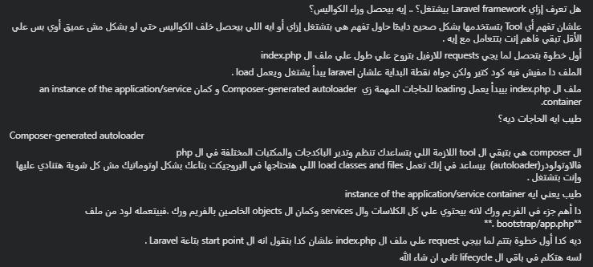
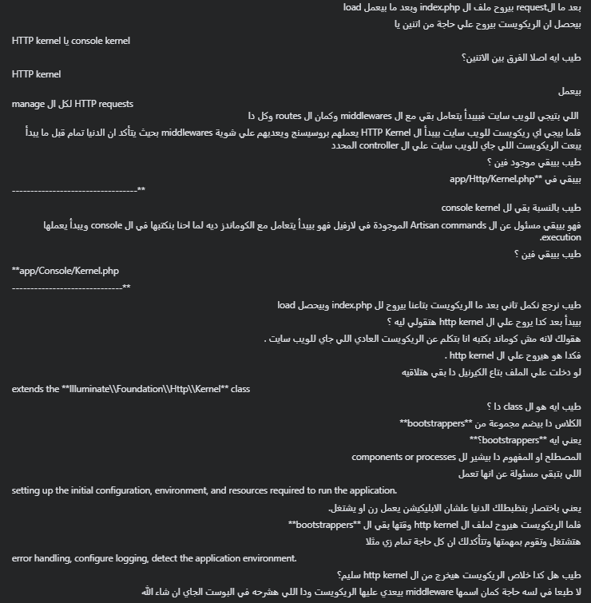
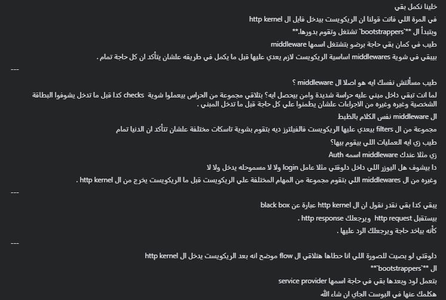
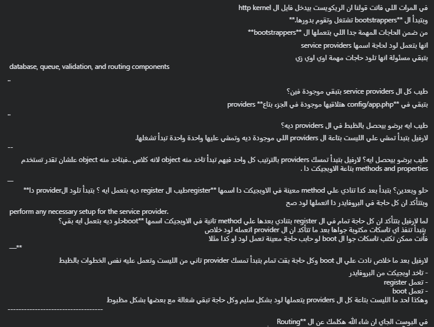
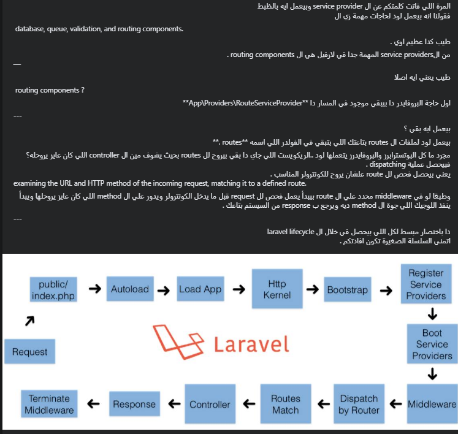

# Laravel lifecycle

#### (1) What are the most common PHP frameworks?

- Laravel
- Symphony
- CodeIgniter
- CakePHP
- Yii

#### (2) What is Doctrine PHP ?

Doctrine is a popular PHP library for object-relational mapping (ORM) and database abstraction. It is commonly used in PHP web development to simplify database interactions by providing a set of tools and patterns for working with databases. Doctrine’s primary goal is to bridge the gap between the object-oriented world of PHP and the relational world of databases.

#### (3) What are the different ORM’s in PHP ?

Doctrine ORM
Eloquent
Propel

#### (4) What is Composer?

Composer is a tool for dependency management in PHP. It allows you to declare the libraries your project depends on and it will manage (install/update) them for you. like npm in node & bundler in Ruby.

#### (5) Sessions vs Cookies in PHP?

##### Sessions

Stored on the server.
Typically last until the user closes the browser or after a period of inactivity.
More secure as data is stored on the server-side.
Can store larger amounts of data.
Data is transferred between the client and server with each request.
Data is accessible only on the server.
Requires a session ID, often stored in a cookie or passed via URL.

##### Cookies

Stored on the client-side (browser).
Can persist beyond the current browsing session based on expiration settings.
Less secure as data is stored on the client-side and can be accessed and modified.
Have size limitations, typically a few kilobytes.
Cookie data is automatically included in HTTP requests to the server.
Data can be accessed and modified by the client.
Set by the server and sent to the client in the HTTP response header.
Difference between Interface and Abstract Class in PHP
The concept of abstract class in PHP is very similar to interface. However, there are a couple of differences between an interface and an abstract class.

| Abstract class                                                                      | Interface                                                                                                         |
| ----------------------------------------------------------------------------------- | ----------------------------------------------------------------------------------------------------------------- |
| Use abstract keyword to define abstract class                                       | Use interface keyword to define interface                                                                         |
| Abstract class cannot be instantiated                                               | Interface cannot be instantiated.                                                                                 |
| Abstract class may have normal and abstract methods                                 | Interface must declare the methods with arguments and return types only and not with any body.                    |
| Abstract class is extended by child class which must implement all abstract methods | Interface must be implemented by another class, which must provide functionality of all methods in the interface. |
| Can have public, private or protected properties                                    | Properties cannot be declared in interface                                                                        |

https://medium.com/@mr-osama-mustafa/50-php-laravel-interview-questions-and-answers-ddfa49ed546d
https://www.fullstack.cafe/blog/php-interview-questions
https://medium.com/@mr-osama-mustafa/50-php-laravel-interview-questions-and-answers-ddfa49ed546d
https://www.tutorialspoint.com/php
https://www.datacamp.com/blog/top-sql-interview-questions-and-answers-for-beginners-and-intermediate-practitioners
